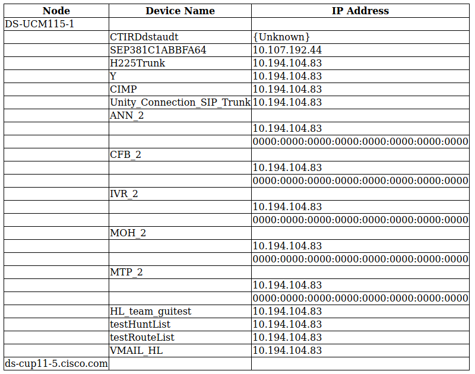

# serviceability-php-samples

## Overview

A set of small sample scripts demonstrating how to use the CUCM Serviceability APIs to retrieve real-time device registration, IP address and other details.  The samples output HTML using PHP and the SoapClient and DOMDocument libraries.



[https://developer.cisco.com/site/sxml/](https://developer.cisco.com/site/sxml/)


## Available samples

* `selectCmDeviceExt_single.php` - Demonstrates retrieving RIS info for one device, by device name ( `<selectCmDeviceExt>` )

* `selectCmDeviceExt_multiple.php` - Retrieve RIS info for multiple devices stored in a simple array ( `<selectCmDeviceExt>` )

* `selectCmDevice_wildcard.php` - Retrieve RIS info for all available devices using the '*' wildcard, and parse out the node name, device name and IPv4/IPv6 address in table format ( `<selectCmDevice>` )

## Getting started

Tested on: Ubuntu 19.10 / Apache2 / PHP 7.3

* Install Apache2:

    ```shell
    sudo apt install apache2
    ```

* Install PHP:

    ```shell
    sudo apt install php libapache2-mod-php

* Install PHP SOAP
    
    ```shell
    sudo apt install php-soap
    ```

* Install DOMDocument:

    ```shell
    sudo apt install php-xml
    ```

* Re-start Apache2 to enable all the new modules:

    ```shell
    sudo systemctl restart apache2

* Clone this repo:

    ```shell
    git clone https://github.com/CiscoDevNet/serviceability-php-samples.git

    cd risport-php-samples
    ```

* Install the Composer PHP package manager ([see instructions](https://getcomposer.org/doc/00-intro.md#installation-linux-unix-macos))
* Install PHP dependencies:

    ```shell
    composer install
    ```

* The Serviceability SOAP API WSDL files for CUCM v12.5 are included in this project.  If you'd like to use a different version, replace the files in `schema/` with the versions from your CUCM, which can be retrieved at:

    * CDRonDemand: `https://{cucm}/CDRonDemandService2/services/CDRonDemandService?wsdl`

    * Log Collection: `https://{cucm}:8443/logcollectionservice2/services/LogCollectionPortTypeService?wsdl`

    * PerfMon: `https://{cucm}:8443/perfmonservice2/services/PerfmonService?wsdl`

    * RisPort70: `https://{cucm}:8443/realtimeservice2/services/RISService70?wsdl`

    * Control Center Services: `https://ServerName:8443/controlcenterservice2/services/ControlCenterServices?wsdl`

    * Control Center Services Extended: `https://ServerName:8443/controlcenterservice2/services/ControlCenterServicesEx?wsdl`

* The project was built/tested using [Visual Studio Code](https://code.visualstudio.com/).  Open the project folder in VS Code:

    ```shell
    code .
    ```
  
* In VS Code:

    * Install the 'PHP Extension Pack' extension (felixfbecker.php-pack) to enable highlighting and intellisense

    * Copy `.env.example` to `.env`, then edit `.env` to specify your CUCM host name/IP and API user credentials

Copy the following files/folders  to your PHP CGI root:

    * `.php`
    * `.env`
    * `schema/`
    * `vendor/`

        E.g. for Apache2 on Ubuntu 19.10: 

        ```shell
        sudo mkdir /var/www/html/serviceability-php-samples/
        
        sudo cp -r {*.php,.env,vendor/,schema/} /var/www/html/serviceability-php-samples/
        ```
* Finally, open the URL corresponding to the desired sample in your browser, e.g.: http://localhost/serviceability-php-samples/selectCmDevice_wildcard.php

## Hints

* **HTTPS certificate checking** For production, see the comments in each sample script file to enable HTTPS certificate authority validity and name checking.  You can retrieve the cert `.pem` file by browsing to the CUCM admin page, and viewing/exporting the chain CA certificate, usually by clicking the 'lock' icon at the front of the URL bar